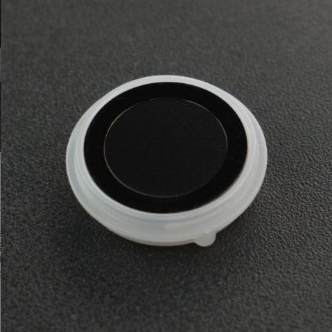

# DFRobot_ID809_I2C
- [English Version](./README.md)

该电容指纹模块集指纹采集、处理、存储及指纹比对为一体。 以ID809高性能处理器和半导体指<br>
纹传感器为核心，内置 IDfinger6.0指纹算法，能够独立完成全部的指纹识别工作。 <br>
该模块采用标准UART通讯，配合Arduino库，非常容易实现指纹录入、图像处理、模板生成、<br>
指纹比对等所有指纹识别功能。该模块外观精致轻薄一体化，具有环形炫酷呼吸灯，指纹识别速度<br>
快、安全性高，支持360度任意角度识别、深度自学习功能、高性能、低功耗。<br>



## 产品链接 (https://www.dfrobot.com.cn/goods-2793.html)
    SEN0348: 电容式指纹识别传感器
	
   
## 目录

  * [概述](#概述)
  * [库安装](#库安装)
  * [方法](#方法)
  * [兼容性](#兼容性)
  * [历史](#历史)
  * [创作者](#创作者)

## 概述

1. 注册指纹
2. 匹配指纹
3. 删除指纹
5. 支持休眠模式

## 库安装

使用此库前，请首先下载库文件，将其粘贴到\Arduino\libraries目录中，然后打开examples文件
夹并在该文件夹中运行演示。


## 方法

```C++
  /**
   * @fn begin
   * @brief 初始化
   * @return 初始化结果
   * @retval 成功
   * @retval 失败
   */
  virtual bool begin(void) = 0;
  
  /**
   * @fn isConnected
   * @brief 测试模块是否正常连接
   * @return 连接结果
   * @retval 成功
   * @retval 失败
   */
  bool isConnected();
  
  /**
   * @fn setDeviceID
   * @brief 设置模块ID
   * @param ID号:1-255
   * @return 设置结果
   * @retval 0 成功
   * @retval ERR_ID809 错误
   */
  uint8_t setDeviceID(uint8_t deviceID);
  
  /**
   * @fn setSecurityLevel
   * @brief  设置模块安全等级
   * @param securityLevel 安全等级:1-5
   * @return 设置结果
   * @retval 0 成功
   * @retval ERR_ID809 错误
   */
  uint8_t setSecurityLevel(uint8_t securityLevel);
  
  /**
   * @fn setDuplicationCheck
   * @brief 设置模块指纹重复检查(在保存指纹时，检查是否已被注册)
   * @param duplicationCheck 1(打开) or 0(关闭)
   * @return 设置结果
   * @retval 0 成功
   * @retval ERR_ID809 错误
   */
  uint8_t setDuplicationCheck(uint8_t duplicationCheck);
  
  /**
   * @fn setBaudrate
   * @brief 设置模块波特率 
   * @param baudrate in typedef enum eDeviceBaudrate_t
   * @return 设置结果
   * @retval 0 成功
   * @retval ERR_ID809 错误
   */
  uint8_t setBaudrate(eDeviceBaudrate_t baudrate);
  
  /**
   * @fn setSelfLearn
   * @brief 设置模块自学功能(在对比指纹成功时，更新指纹)
   * @param selfLearn 1(打开) or 0(关闭)
   * @return 设置结果
   * @retval 0 成功
   * @retval ERR_ID809 错误
   */
  uint8_t setSelfLearn(uint8_t selfLearn);
  
  /**
   * @fn getDeviceID
   * @brief 读取模块ID
   * @return 指纹识别到的ID
   * @retval ID号:1-255
   * @retval ERR_ID809 错误
   */
  uint8_t getDeviceID();
  
  /**
   * @fn getSecurityLevel
   * @brief 读取模块安全等级
   * @return 安全等级
   * @retval 安全等级:1-5
   * @retval ERR_ID809 错误
   */
  uint8_t getSecurityLevel();
  
  /**
   * @fn getDuplicationCheck
   * @brief 读取模块指纹重复检查状态
   * @return 测试结果
   * @retval 1 打开
   * @retval 0 关闭
   * @retval ERR_ID809 错误
   */
  uint8_t getDuplicationCheck();
  
  /**
   * @fn getBaudrate
   * @brief 读取模块波特率 
   * @return 波特率
   */
  uint8_t getBaudrate();
  
  /**
   * @fn getSelfLearn
   * @brief 读取模块自学功能状态
   * @return 结果
   * @retval 1 打开
   * @retval 0 关闭
   * @retval ERR_ID809 错误
   */
  uint8_t getSelfLearn();
   
  /**
   * @fn getDeviceInfo
   * @brief 读取设备号
   * @return 设备号
   */
  String getDeviceInfo();
  
  /**
   * @fn setModuleSN
   * @brief 设置序列号
   * @param SN 序列号字符串 
   * @return 设置结果
   * @retval 0 成功
   * @retval ERR_ID809 错误
   */
  uint8_t setModuleSN(const char* SN);
  
  /**
   * @fn getModuleSN
   * @brief 读取序列号
   * @return 序列号字符串
   */
  String getModuleSN();
  
  /**
   * @fn ctrlLED
   * @brief Set LED
   * @param mode in typedef enum eLEDMode_t
   * @param color in typedef enum eLEDColor_t
   * @param blinkCount 0表示一直呼吸、闪烁，该参数仅在eBreathing、eFastBlink、eSlowBlink模式下有效nk
   * @return 设置结果
   * @retval 0 成功
   * @retval ERR_ID809 错误
   */
  uint8_t ctrlLED(eLEDMode_t mode,eLEDColor_t color,uint8_t blinkCount);
  
  /**
   * @fn detectFinger
   * @brief 检测是否有手指触碰
   * @return 检测结果
   * @retval 1 有手指 
   * @retval 0 无手指 
   */
  uint8_t detectFinger();
  
  /**
   * @fn getEmptyID
   * @brief 获取可注册首个编号
   * @return 可注册ID号 or Error Code
   */
  uint8_t getEmptyID();
  
  /**
   * @fn getStatusID
   * @brief 检查ID是否已被注册
   * @param ID 要检测的ID
   * @return 注册状态
   * @retval 0 已注册 
   * @retval 1 未注册
   */
  uint8_t getStatusID(uint8_t ID);
  
  /**
   * @fn getEnrollCount
   * @brief 获取注册用户数量
   * @return 册用户数量 or ERR_ID809
   */
  uint8_t getEnrollCount();
  
  /**
   * @fn getEnrolledIDList
   * @brief 获取已注册用户列表
   * @param list  用户列表
   * @return 错误码
   * @retval 0 成功
   * @retval ERR_ID809 错误
   */
   uint8_t getEnrolledIDList(uint8_t* list);
  
  /**
   * @fn collectionFingerprint
   * @brief 采集指纹
   * @param timeout 超时检测
   * @return 错误码
   * @retval 0 成功
   * @retval ERR_ID809 错误
   */
  uint8_t collectionFingerprint(uint16_t timeout);
  
  /**
   * @fn storeFingerprint
   * @brief 保存指纹 
   * @param ID 指纹ID
   * @return 设置结果
   * @retval 0 成功
   * @retval ERR_ID809 错误
   */
  uint8_t storeFingerprint(uint8_t ID);
  
  /**
   * @fn delFingerprint
   * @brief 删除指纹
   * @param ID 指纹ID or DELALL(全部删除)
   * @return 设置结果
   * @retval 0 成功
   * @retval ERR_ID809 错误
   */
  uint8_t delFingerprint(uint8_t ID);
  
  /**
   * @fn search
   * @brief 将指纹与全部指纹匹配
   * @return 匹配成功的指纹ID、0(匹配失败) or ERR_ID809
   */
  uint8_t search();

  /**
   * @fn verify
   * @brief 将指纹与指定指纹匹配
   * @brief ID
   * @return 匹配成功的指纹ID、0(匹配失败) or ERR_ID809
   */
  uint8_t verify(uint8_t ID);

  /**
   * @fn match
   * @brief 指定两个RamBuffer的模板进行对比
   * @param RamBufferID0 number 
   * @param RamBufferID1 number 
   * @return 匹配结果
   * @retval 0 成功
   * @retval ERR_ID809 错误
   */
  uint8_t match(uint8_t RamBufferID0, uint8_t RamBufferID1);
  
  /**
   * @fn getBrokenQuantity
   * @brief 得到指纹损坏数量
   * @return 损坏的指纹ID号 or ERR_ID809
   */
  uint8_t getBrokenQuantity();

  /**
   * @fn getBrokenID
   * @brief 得到第一个损坏指纹ID
   * @return 损坏的指纹ID号 or ERR_ID809 
   */
  uint8_t getBrokenID();
  
  /**
   * @fn loadFingerprint
   * @brief 取出指纹模板，暂存到RamBuffer中
   * @param ID 指纹ID号
   * @param RamBuffer ID号 0-2
   * @return 设置结果
   * @retval 0 成功
   * @retval ERR_ID809 错误
   */
  uint8_t loadFingerprint(uint8_t ID, uint8_t RamBufferID);
  
  /**
   * @fn enterSleepState
   * @brief 进入休眠状态
   * @return 设置结果
   * @retval 0 成功
   * @retval ERR_ID809 错误
   */
  uint8_t enterSleepState();
  
  /**
   * @fn getErrorDescription
   * @brief 获取错误信息
   * @return 错误信息的文本描述
   */
  String getErrorDescription();
```

## 兼容性

MCU                | Work Well    | Work Wrong   | Untested    | Remarks
------------------ | :----------: | :----------: | :---------: | -----
Arduino Uno        |      √       |              |             | 
Mega2560        |      √       |              |             | 
Leonardo        |      √       |              |             | 
ESP32        |      √       |              |             | 
ESP8266        |      √       |              |             | 
M0        |      √       |              |             | 


## 历史

- 2021/12/14 - 1.0.0 版本
- 2023/08/04 - 1.0.1 版本
- 2024/03/11 - 1.1.1 版本

## 创作者

Written by Eddard(Eddard.liu@dfrobot.com), 2020. (Welcome to our [website](https://www.dfrobot.com/))


